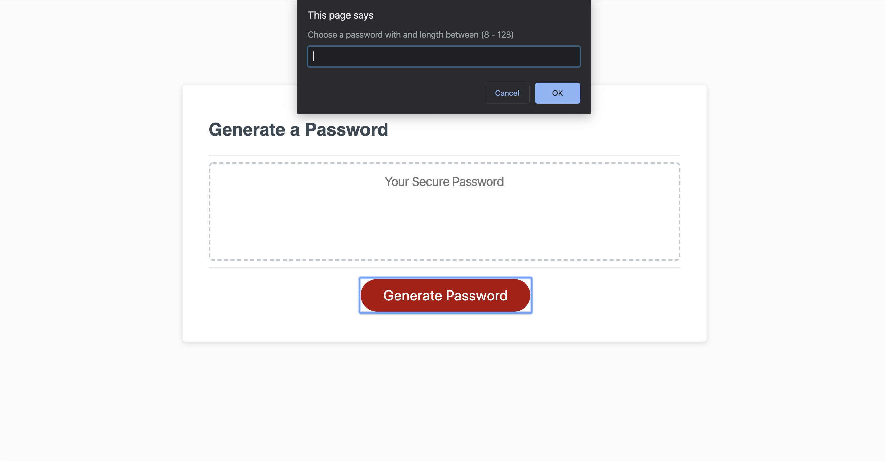

# random-password

A program that randomly generates a password based on user input

Password can include:
-Uppercase
-Lowercase
-Numbers
-Symbols

# screenshot

# link to site

https://joshprice315.github.io/random-password/
